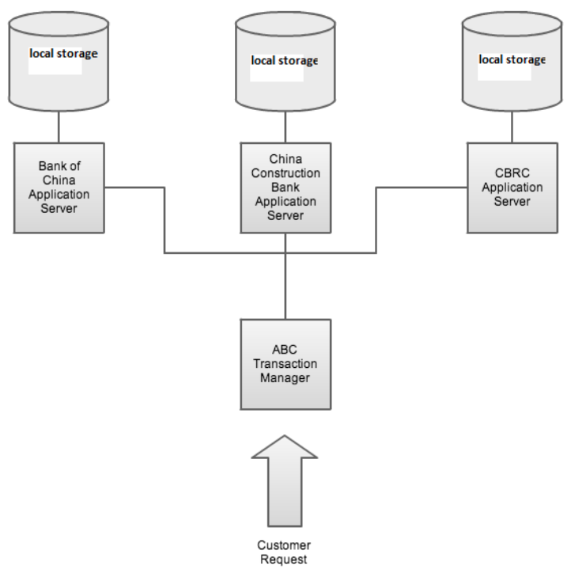
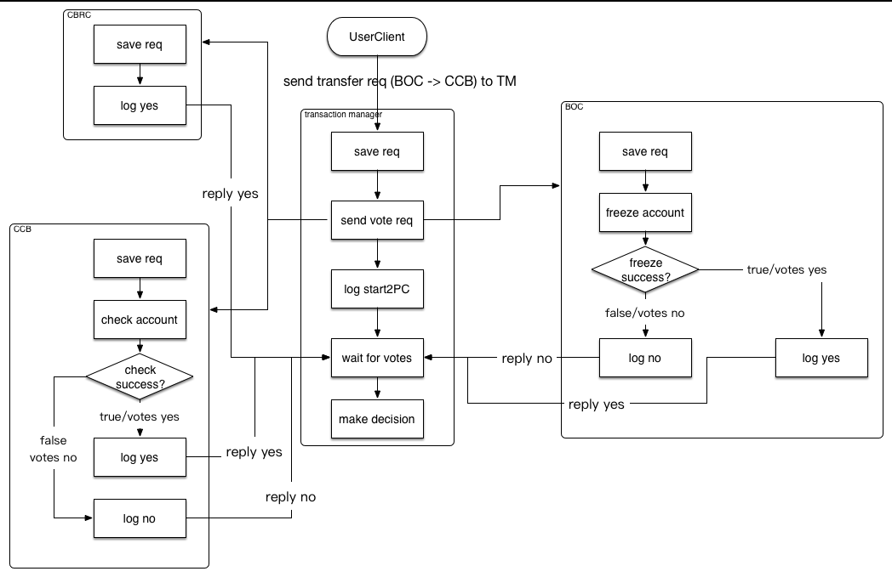
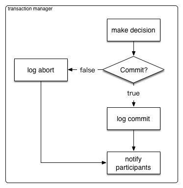
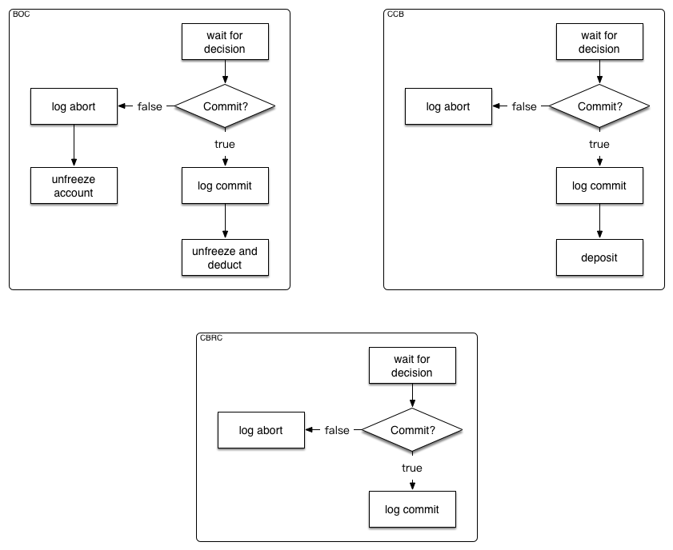

# Two-phase Commit Protocol Demo Project
## Demo Project Scenario
The company ABC provides its customers wire transfer service. For example, it can withdraw $1000 from John's account in Bank of China and deposit the money to John's another account in China Construction Bank. Also, it should report this transaction to China Banking Regulatory Commission (CBRC) for auditing purpose. 

The following diagram illustrates the system architecture.

## Demo Project Build Requirements
+ maven 
+ Jdk 1.8+

## Demo Project Runtime Requirements
+ Jdk 1.8+
+ Mysql

## Quick Start
There is a sub-directory named quickstart under the project's root directory. It contains the packaged executable jars 
and shell scripts for building, starting and stopping the demo applications.

Before you try to start the demo applications using the quickstart scripts, you need to do some preparation work.

1. Start a Mysql server instance locally listening on port 3306 
(the demo applications connect to 127.0.0.1:3306 by default, but you can override this behaviour. We'll talk about that 
later). 

2. Then you need to create a username 'test' with password 'test', which will be used for authentication when 
connecting to the Mysql server.

3. Create 4 databases, bank_boc, bank_ccb, cbrc and transaction_manager and grant all privileges needed to create 
tables, query and update records to the 'test' user we've just created.
 
Now we are ready to start the demo applications using the shell script.

    cd quickstart/sh  
    ./start.sh servers
    
The last command will start the BOC server, CCB server, CBRC server and the transaction manager server, which are listening 
on port 8001, 8002, 8003, 8000 respectively. 

Now you're ready to do a demo wire transfer.

    ./start.sh client from-bank from-account to-bank to-account transfer-amount
    
There are only two bank name options, BOC and CCB. By default, BOC will have one account installed when started for the
first time, with account id 1, and balance amount 10000; CCB will also have one account installed when started for the
first time, with account id 2, and balance amount 0.

So if you want to transfer 2000 from bank BOC account 1 to bank CCB account 2, your command will be 

    ./start.sh client BOC 1 CCB 2 2000
    
If you try a not supported bank name or not exist account id or invalid transfer amount, this transaction will fail.

When you finish your test, use the stop.sh script to stop all the servers.
    
    ./stop.sh servers
    
If you want to build the project, you can make use of the build.sh script.

    ./build.sh
    
It will compile the project, package each demo application into a stand-alone executable jar and copy them into the 
quickstart/jar directory.

## Customize Mysql Connection Address and Server Listening Port
If you want to change the Mysql server that a demo application connects to and change the default http listening port,
you can use system properties to configure your values. 

### Default Configurations

demo application name | listening port |       mysql url
----------------------|----------------|-----------------
BOC server            |server.port=8001|spring.datasource.url=jdbc:mysql://localhost:3306/bank_boc
CCB server            |server.port=8002|spring.datasource.url=jdbc:mysql://localhost:3306/bank_ccb
CBRC server           |server.port=8003|spring.datasource.url=jdbc:mysql://localhost:3306/cbrc
transaction manager   |server.port=8000|spring.datasource.url=jdbc:mysql://localhost:3306/transaction_manager

If you want to change BOC server's listening port to 8801 and it's mysql server host to 192.168.1.2, you can start BOC 
server like this

    cd quickstart/jar
    java -Dspring.datasource.url=jdbc:mysql://192.168.1.2:3306/bank_boc -Dserver.port=8801 -jar boc-server-1.0-SNAPSHOT.jar
    
*Notice: the database names in the last part of the datasource url should remain unchanged*

## System Design
Suppose we are transfering some money from bank BOC to bank CCB. Then the typical workflow is like this.

After the transaction manager collects all the vote results (in case of participants timed out during the vote process, 
the transaction manager assume that these participants vote No), it will make a decision and send the decision to participants.

When the participants receive the decision, they will act accordingly.

## How Various Abnormal Situations are Handled
1. If a participant votes Yes and goes down after sending Yes to the transaction manager, then how will this participant  
resolve the final decision?
The participant uses cooperative termination protocol to resolve the final decision. That is, it first ask its peer
participant for the final decision. If the peers don't know the decision neither, it will consult the transaction manager.

2. How servers recover from crashes?
Server states are stored in persistent db, so that when come back from crash, the servers can recover their state and
resolve the undecided transactions with cooperative termination protocol. 

3. Suppose we are transferring 2000 RMB from BOC account A (with balance 2000 RMB) to CCB account B. During the vote phase,  
BOC checks account A and votes Yes as there is enough balance. However, while BOC is waiting for the transaction manager's
 decision, others may deduct 1000 RMB from account. So when BOC receives the transaction manager's Commit decision, it
can't do commit because there is not enough balance. How this situation is handled?
During the voting phase, BOC will freeze the requested transferring amount of money, so that others can not use. At the
decision phase, the frozen money will be unfrozen and deducted.
    
    

    
    

